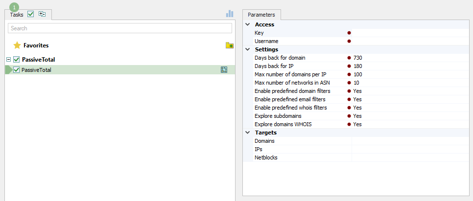

# RiskIQ - PassiveTotal

RiskIQ PassiveTotal aggregates data from the whole internet, absorbing intelligence to identify threats and attacker infrastructure, and leverages machine learning to scale threat hunting and response. With PassiveTotal, you get context on who is attacking you, their tools and systems, and indicators of compromise outside the firewall—enterprise and third party. © [PassiveTotal](https://www.riskiq.com/products/passivetotal/)

## Lampyre script

In general this backend script provide ability to enrich IP/Domains (or whole netblock) with context through intelligence data from PassiveTotal.

List of features:

    1. Enriches domain with passive dns information (history of resolves).
    2. Enriches domain with history of whois records.
    3. Enriches domain with history of subdomains.
    4. Enriches every discovered IP with history of certificates, cookies, components which were discovered.
    5. Filters out noisy IP
    6. Filters out useless information by simple regexp.

## Chanelog

* 04.04.22 - Add Scheme for domain <-> ip relationship for drag and drop to graph
